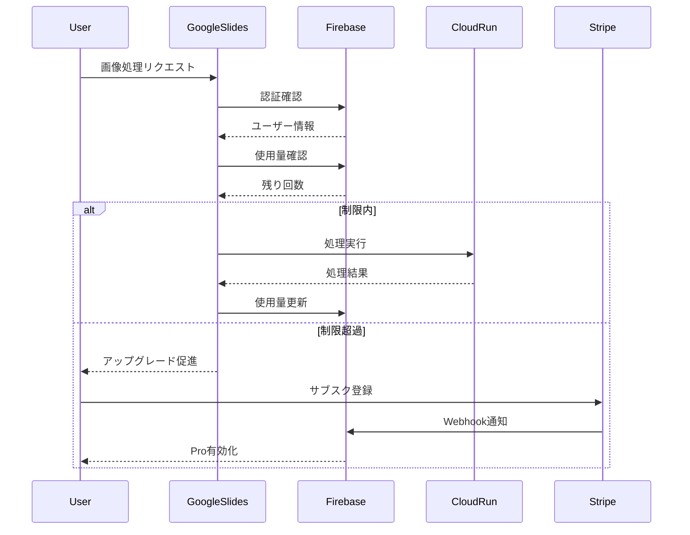

# サブスクリプションモデル設計書

**プロジェクト**: Slide AI Tool
**バージョン**: 1.0
**最終更新**: 2025-11-24
**月額料金**: $7 (約¥1,050)

---

## 目次

1. [プラン設計](#プラン設計)
2. [価格設定の根拠](#価格設定の根拠)
3. [システムアーキテクチャ](#システムアーキテクチャ)
4. [データベース設計](#データベース設計)
5. [実装プラン](#実装プラン)
6. [収益シミュレーション](#収益シミュレーション)
7. [次のステップ](#次のステップ)

---

## プラン設計

### 2段階プラン構成

| 機能 | 🆓 Freeプラン | ⭐ Proプラン |
|------|--------------|-------------|
| **月額料金** | **$0** | **$7** (約¥1,050) |
| **AI画像拡張** | **3回/月** | **80回/月** |
| **AI高画質化** | **2回/月** | **50回/月** |
| **トリミング確定** | ✅ 無制限 | ✅ 無制限 |
| **色調調整** | ✅ 無制限 | ✅ 無制限 |
| **エフェクト** | ✅ 無制限 | ✅ 無制限 |
| **バッチ処理** | ❌ | ✅（複数画像一括処理） |
| **履歴保存** | ❌ | ✅（30日間） |
| **処理優先度** | 通常 | 高優先 |
| **サポート** | コミュニティ | メールサポート（24h以内） |

---

## 価格設定の根拠

### AI処理コスト試算

**Imagen API 単価:**
- 画像拡張: 約$0.10/回
- 高画質化: 約$0.05/回

**Proプラン最大使用時のコスト:**
```
(80回 × $0.10) + (50回 × $0.05) = $10.5
```

**平均使用率**: 約30-40%
**平均原価**: 約$3-4/ユーザー
**純利益率**: 約50-60% ($3.5-4.2/ユーザー)

### 競合比較

| サービス | 月額 | AI画像処理 | 備考 |
|---------|------|-----------|------|
| **当サービス Pro** | **$7** | **130回** | - |
| Remove.bg Pro | $9.99 | 40回 | 背景削除のみ |
| Canva Pro | $12.99 | 制限あり | 総合デザインツール |
| Adobe Express | $9.99 | 制限あり | Adobe製品 |

**価値提案**: 月$7で合計130回の処理 = 1回あたり約$0.05

---

## システムアーキテクチャ

### 全体構成

```
┌─────────────────────────┐
│   Google Slides         │
│   + Add-on UI           │
└───────────┬─────────────┘
            │
            ↓ Firebase Authentication
┌─────────────────────────┐
│   Firebase              │
│   - Authentication      │
│   - Firestore Database  │
│   - Cloud Storage       │
└───────────┬─────────────┘
            │
            ↓ Check Quota & Plan
┌─────────────────────────┐
│   Cloud Run             │
│   - Backend API         │
│   - Image Processing    │
└───────────┬─────────────┘
            │
            ↓ Billing & Webhooks
┌─────────────────────────┐
│   Stripe                │
│   - Subscriptions       │
│   - Payment Processing  │
└─────────────────────────┘
```

### 技術スタック

| レイヤー | 技術 | 理由 |
|---------|------|------|
| フロントエンド | Google Apps Script | Google Slides拡張機能 |
| 認証 | Firebase Authentication | Google統合、簡単実装 |
| データベース | Firestore | リアルタイム、スケーラブル |
| ストレージ | Cloud Storage | 履歴画像保存（Pro限定） |
| バックエンド | Cloud Run (Python) | 既存実装、サーバーレス |
| 決済 | Stripe | 信頼性、グローバル対応 |

### 処理フロー



---

## データベース設計

### Firestore コレクション構造

#### 1. users コレクション

```javascript
users/{userId} = {
  // 基本情報
  email: "user@example.com",
  displayName: "田中太郎",
  photoURL: "https://...",

  // サブスクリプション情報
  planType: "free" | "pro",
  subscriptionId: "sub_xxx" | null,
  subscriptionStatus: "active" | "canceled" | "past_due" | null,
  stripeCustomerId: "cus_xxx" | null,

  // 使用量（月次リセット）
  usage: {
    aiExtend: {
      count: 15,                        // 今月の使用回数
      limit: 80,                        // free=3, pro=80
      resetDate: "2025-12-01T00:00:00Z" // 次回リセット日
    },
    aiUpscale: {
      count: 5,
      limit: 50,                        // free=2, pro=50
      resetDate: "2025-12-01T00:00:00Z"
    }
  },

  // Pro限定機能フラグ
  features: {
    batchProcessing: true,     // バッチ処理（Proのみ）
    historyEnabled: true,      // 履歴保存（Proのみ）
    priorityProcessing: true   // 優先処理（Proのみ）
  },

  // メタデータ
  createdAt: timestamp,
  updatedAt: timestamp,
  lastLoginAt: timestamp
}
```

#### 2. history コレクション（Pro限定）

```javascript
history/{userId}/images/{imageId} = {
  // 画像データ
  originalImage: "gs://bucket/path/original.png",  // Cloud Storage URL
  processedImage: "gs://bucket/path/processed.png",
  thumbnailUrl: "https://...",

  // 処理情報
  processType: "extend" | "upscale",
  settings: {
    extW: 20,
    extH: 30,
    // その他設定
  },

  // メタデータ
  createdAt: timestamp,
  expiresAt: timestamp,  // 30日後に自動削除
  fileSize: 1024000      // バイト
}
```

#### 3. subscriptionEvents コレクション（監査ログ）

```javascript
subscriptionEvents/{eventId} = {
  userId: "user123",
  eventType: "subscription.created" | "subscription.updated" | "subscription.deleted",
  stripeEventId: "evt_xxx",
  planType: "pro",
  amount: 7.00,
  currency: "usd",
  status: "succeeded",
  createdAt: timestamp
}
```

---

## 実装プラン

### MVP（必須機能 - 1週間）

#### Phase 1: 認証・使用量トラッキング（3日）

**タスク:**
- [ ] Firebase プロジェクト作成
- [ ] Firebase Authentication 設定（Google認証）
- [ ] Google Apps Script に Firebase SDK 統合
- [ ] ログイン/ログアウトUI実装
- [ ] Firestore でユーザーデータ作成
- [ ] 使用量カウント機能実装
- [ ] 制限チェック機能実装
- [ ] 月次リセットCloud Function作成

**成果物:**
- ログイン機能
- 使用量トラッキング
- 制限超過時のエラーメッセージ

---

#### Phase 2: Stripe決済（2日）

**タスク:**
- [ ] Stripe アカウント作成
- [ ] Stripe Product & Price 設定（$7/月）
- [ ] Stripe Checkout 統合
- [ ] Stripe Webhook エンドポイント作成
- [ ] Webhook署名検証実装
- [ ] サブスク状態の同期処理
- [ ] キャンセル処理実装

**成果物:**
- Stripe決済フロー
- 自動課金
- サブスク管理

---

#### Phase 3: UI実装（2日）

**タスク:**
- [ ] サイドバーにログインボタン追加
- [ ] プラン表示UI（Free/Pro）
- [ ] 使用状況ダッシュボード
- [ ] アップグレード画面
- [ ] 制限超過時のプロンプト
- [ ] サブスク管理画面（キャンセル）

**成果物:**
- 完全なユーザーフロー
- プラン比較ページ
- ダッシュボード

---

### 追加機能（リリース後）

#### Phase 4: バッチ処理（1週間）

**タスク:**
- [ ] 複数画像選択UI
- [ ] 処理キュー実装
- [ ] 進捗表示バー
- [ ] エラーハンドリング

**成果物:**
- 一括処理機能

---

#### Phase 5: 履歴保存（1週間）

**タスク:**
- [ ] Cloud Storage 設定
- [ ] 画像アップロード機能
- [ ] 履歴一覧UI
- [ ] 画像復元機能
- [ ] 30日後自動削除

**成果物:**
- 編集履歴機能

---

#### Phase 6: 優先処理（3日）

**タスク:**
- [ ] プラン別処理キュー
- [ ] Pro優先ルーティング
- [ ] レート制限実装

**成果物:**
- 優先処理システム

---

## 収益シミュレーション

### ユーザー規模別の収益予測

| ユーザー数 | 有料転換率 | 有料ユーザー | 月額収益 | Stripe手数料 | AI原価 | 純利益 | 年間純利益 |
|-----------|-----------|------------|---------|-------------|--------|--------|-----------|
| 100人 | 5% | 5人 | $35 | $1.50 | $15 | **$18.50** | $222 |
| 500人 | 10% | 50人 | $350 | $15 | $150 | **$185** | $2,220 |
| 1,000人 | 15% | 150人 | $1,050 | $45 | $450 | **$555** | $6,660 |
| 5,000人 | 20% | 1,000人 | $7,000 | $300 | $3,000 | **$3,700** | $44,400 |
| 10,000人 | 25% | 2,500人 | $17,500 | $750 | $7,500 | **$9,250** | $111,000 |

### コスト内訳

**固定費（月額）:**
- Firebase Blaze プラン: ~$25（1,000ユーザー規模）
- Cloud Run: ~$50（従量課金）
- ドメイン・その他: ~$10
- **合計固定費**: ~$85/月

**変動費:**
- Stripe手数料: 売上の4.3%
- Imagen API: 使用量に応じて

**損益分岐点**: 約20人の有料ユーザー（$140/月）

---

## 次のステップ

### 実装方針の選択

#### Option A: フル自動実装（推奨）
- **期間**: 1週間
- **内容**: MVP（認証+決済+UI）を完全実装
- **メリット**: スケーラブル、自動化
- **デメリット**: 初期開発コスト高

#### Option B: 半自動実装
- **期間**: 2-3日
- **内容**: 認証+手動決済確認
- **メリット**: 素早くリリース
- **デメリット**: 手動作業必要

#### Option C: 段階的実装
- **期間**: フェーズごとに実装
- **内容**: 認証 → 決済 → 追加機能
- **メリット**: フィードバック反映可能
- **デメリット**: リリースまで時間

---

### 開発タイムライン（Option A）

```
Week 1: MVP実装
├── Day 1-3: 認証・使用量トラッキング
├── Day 4-5: Stripe決済統合
└── Day 6-7: UI実装・テスト

Week 2: テスト・リリース準備
├── Day 8-10: 統合テスト
├── Day 11-12: ドキュメント作成
└── Day 13-14: ソフトローンチ

Week 3以降: 追加機能開発
├── バッチ処理
├── 履歴保存
└── 優先処理
```

---

## 価格ページ設計

### セールスポイント

**🎯 こんな方におすすめ:**
- プレゼン資料を頻繁に作成するビジネスパーソン
- 画像編集に時間をかけたくない方
- 高品質な資料を短時間で作りたい方

**✨ Proプランの価値:**
- **月130回の処理** = 1回あたり約$0.05
- **時間節約**: 1回5分の編集 × 130回 = 約11時間/月
- **コスト削減**: 外注費用 $50/画像 → $0.05/画像

**💪 他ツールとの比較:**

| 項目 | 当サービス | Remove.bg | Canva Pro |
|-----|----------|-----------|----------|
| 月額 | $7 | $9.99 | $12.99 |
| AI処理回数 | 130回 | 40回 | 制限あり |
| Google Slides統合 | ✅ | ❌ | △ |
| バッチ処理 | ✅ | ✅ | ❌ |

---

## 技術仕様書

### API エンドポイント

#### 1. 認証確認
```
POST /api/auth/verify
Request: { firebaseToken: string }
Response: { userId: string, planType: string }
```

#### 2. 使用量確認
```
GET /api/usage/{userId}
Response: {
  aiExtend: { count: number, limit: number, remaining: number },
  aiUpscale: { count: number, limit: number, remaining: number }
}
```

#### 3. 画像処理
```
POST /api/process
Request: {
  userId: string,
  mode: "extend" | "upscale",
  image: base64,
  settings: {...}
}
Response: { result_image: base64, usage: {...} }
```

#### 4. Stripe Webhook
```
POST /api/webhook/stripe
Headers: { stripe-signature: string }
Body: Stripe Event Object
```

---

### セキュリティ対策

1. **認証**:
   - Firebase Authentication トークン検証
   - HTTPS必須

2. **API保護**:
   - レート制限（100req/分）
   - CORS設定

3. **データ保護**:
   - Firestore セキュリティルール
   - Cloud Storage 署名付きURL

4. **決済セキュリティ**:
   - Stripe Webhook署名検証
   - PCI-DSS準拠（Stripeが対応）

---

## マーケティング戦略

### ローンチ計画

**Phase 1: ソフトローンチ（最初の100人）**
- 無料プランのみ提供
- フィードバック収集
- バグ修正

**Phase 2: 有料プランリリース**
- 既存ユーザーへアップグレード案内
- 早期割引（最初の50人: $5/月）
- Product Hunt掲載

**Phase 3: マーケティング拡大**
- Google Workspace Marketplace 掲載
- YouTube チュートリアル作成
- ブログ記事・SEO対策

---

### KPI（重要業績評価指標）

| 指標 | 目標（3ヶ月） | 目標（6ヶ月） |
|-----|-------------|-------------|
| 総ユーザー数 | 500人 | 2,000人 |
| 有料転換率 | 10% | 15% |
| 月間収益 | $350 | $2,100 |
| チャーンレート | <5% | <3% |
| NPS | >50 | >60 |

---

## よくある質問（FAQ）

### ユーザー向け

**Q: 無料プランでできることは？**
A: AI画像拡張3回/月、AI高画質化2回/月、その他の機能は無制限です。

**Q: サブスクはいつでもキャンセルできますか？**
A: はい、いつでもキャンセル可能です。日割り返金はありません。

**Q: 使用回数は翌月に繰り越されますか？**
A: いいえ、毎月1日にリセットされます。

**Q: 処理した画像の権利は？**
A: すべてお客様に帰属します。当サービスは保存しません（Pro履歴機能除く）。

---

### 開発者向け

**Q: Firebase と Stripe の連携方法は？**
A: Stripe Webhook → Cloud Functions → Firestore 更新

**Q: 月次リセットの実装方法は？**
A: Cloud Scheduler + Cloud Functions で毎月1日0時に実行

**Q: 使用量制限のチェックタイミングは？**
A: 処理実行前にFirestoreから取得してチェック

---

## 付録

### A. 必要なサービス・アカウント

- [ ] Google Cloud Platform
- [ ] Firebase
- [ ] Stripe
- [ ] （オプション）Sendgrid（メール通知）
- [ ] （オプション）Google Analytics

### B. 開発環境セットアップ

```bash
# Firebase CLI
npm install -g firebase-tools
firebase login

# Stripe CLI（テスト用）
brew install stripe/stripe-cli/stripe
stripe login
```

### C. 環境変数

```bash
# .env.local
FIREBASE_API_KEY=xxx
FIREBASE_PROJECT_ID=slide-ai-tool
STRIPE_SECRET_KEY=sk_test_xxx
STRIPE_WEBHOOK_SECRET=whsec_xxx
```

---

## 変更履歴

| バージョン | 日付 | 変更内容 |
|-----------|------|---------|
| 1.0 | 2025-11-24 | 初版作成（月額$7プラン） |

---

## 連絡先・サポート

**プロジェクト責任者**: [名前]
**メール**: [メールアドレス]
**リポジトリ**: https://github.com/[your-repo]

---

**End of Document**
